# Lab1Web - Praktikum 1: HTML Dasar

**Nama:** Najla Wening Khairunnisa
**NIM:** 312510225
**Program Studi:** Teknik Informatika

## Langkah Praktikum

### 1. Struktur Dasar HTML
Membuat file index.html dengan struktur dasar HTML5.

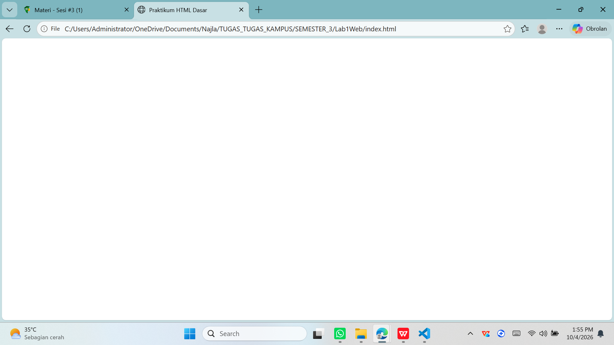

### 2. Membuat Paragraf
Menambahkan dua paragraf dengan tag `
`.

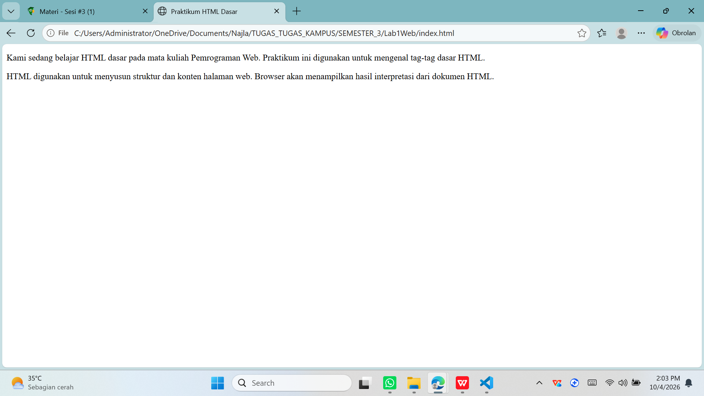

### 3. Menambahkan Judul
Menambahkan `<h1>` dan `<h2>`.

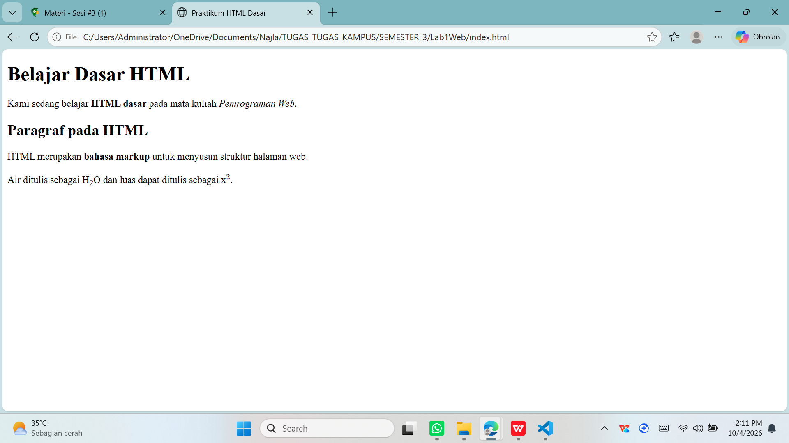

### 4. Memformat Teks
Menggunakan `<b>`, `<i>`, `<strong>`, ``, ``, `<mark>`, `<del>`, `<ins>`.

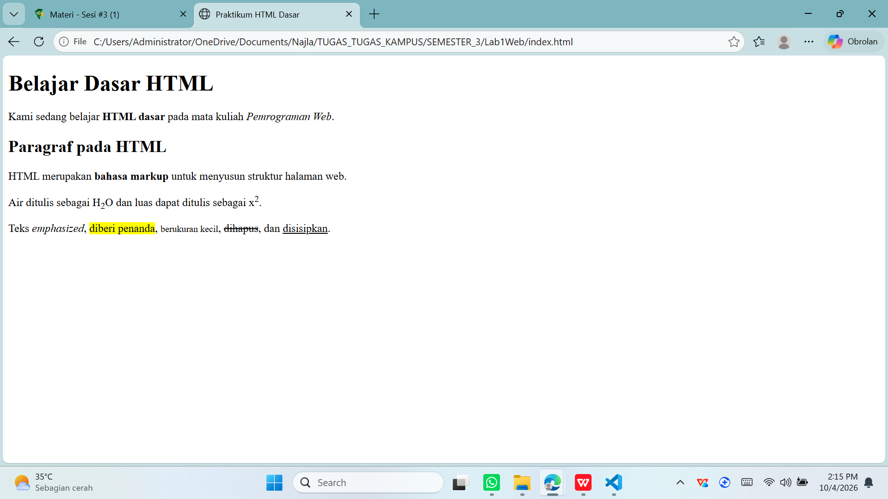

### 5. Menyisipkan Gambar
Menyimpan gambar di folder images dan menampilkannya dengan ``.

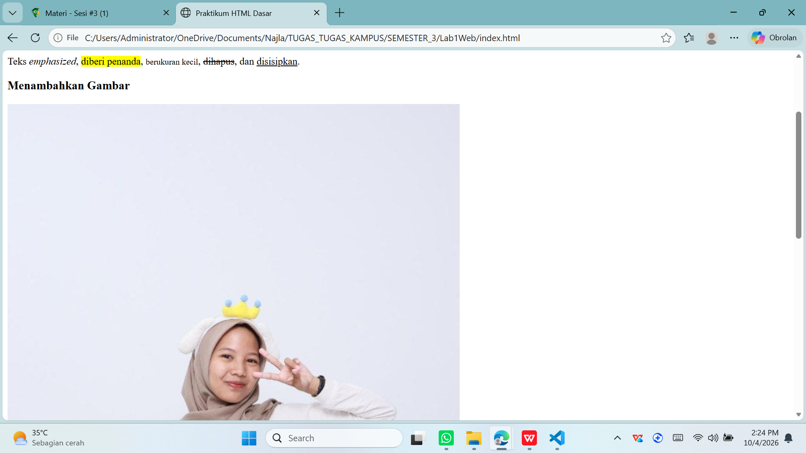

### 6. Mengatur Ukuran Gambar
Menambahkan atribut `width="200"`.

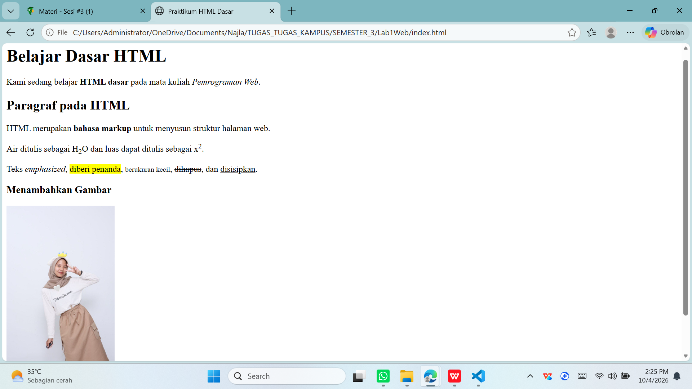

### 7. Menambahkan Hyperlink
Membuat halaman2.html dan menu navigasi (link internal dan eksternal).

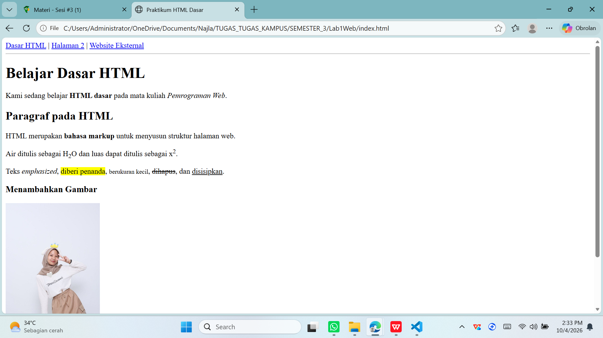

### 8. Menambahkan List
Membuat unordered list (`<ul>`) dan ordered list (`<ol>`).

### 9. Menambahkan Komentar
Menambahkan komentar `<!-- -->`. Komentar tidak tampil di browser.

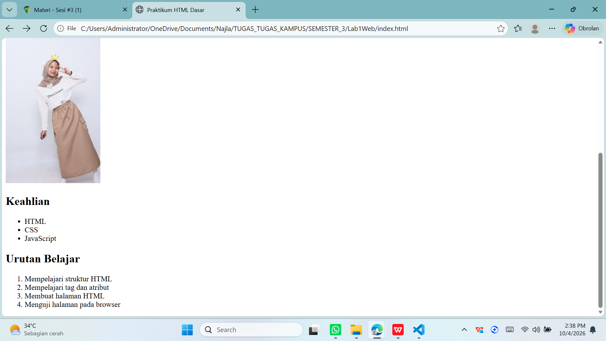

### 10. Halaman Profil Mahasiswa
Menggabungkan semua elemen pada halaman2.html.

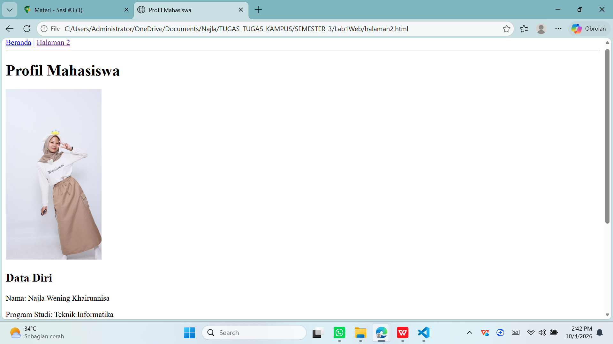

### 11. Validasi W3C
Memeriksa index.html dan halaman2.html di validator.w3.org. Awalnya ada
warning (atribut lang) dan error (charset), lalu diperbaiki dengan
`<html lang="id">` dan `<meta charset="UTF-8">`.

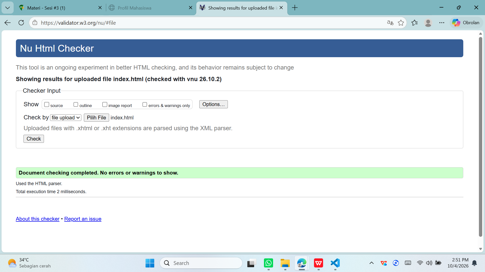
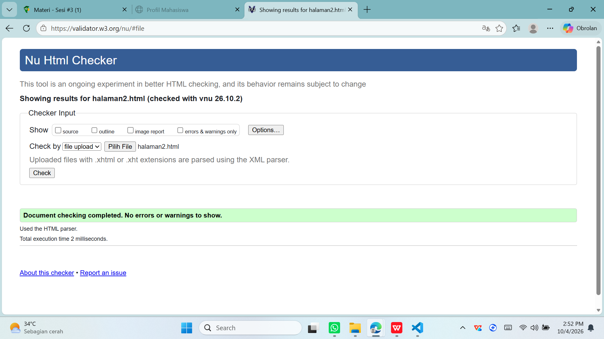

## Jawaban Pertanyaan

**1. Apa fungsi deklarasi `<!DOCTYPE html>` pada dokumen HTML?**
Fungsinya buat ngasih tahu browser kalau dokumen yang kita buat pakai standar HTML5. Jadi browser tahu harus nampilin halamannya pakai aturan yang mana. Makanya baris ini selalu ditulis paling atas, sebelum tag lainnya.

**2. Apa perbedaan antara tag, elemen, dan atribut pada HTML?**
Dari yang saya pahami:
- **Tag** itu penanda yang ditulis pakai kurung siku, kayak `
` buat pembuka dan `
` buat penutup.
- **Elemen** itu satu paket lengkapnya: tag pembuka, isinya, dan tag penutup. Contohnya `
Halo
`.
- **Atribut** itu tambahan informasi di dalam tag pembuka. Contohnya `href="index.html"` di tag `<a>`, yang nunjukin link-nya mau ke mana.

**3. Apa perbedaan `
` dengan ` `? Jelaskan penggunaannya.**
`
` dipakai buat bikin satu paragraf utuh, dan otomatis ada jarak sama paragraf di bawahnya. Kalau ` ` cuma bikin teks pindah ke baris baru, tapi masih di paragraf yang sama dan nggak ada jarak tambahan. ` ` juga nggak perlu tag penutup. Jadi kalau mau misahin paragraf pakai `
`, kalau cuma mau ganti baris pakai ` `.

**4. Apa fungsi atribut `href` pada tag `<a>`?**
`href` dipakai buat nentuin tujuan link. Isinya bisa alamat website, nama file halaman lain, atau id bagian di halaman yang sama (pakai tanda `#`). Tanpa `href`, link-nya nggak bakal ke mana-mana.

**5. Apa perbedaan hyperlink ke halaman internal dengan hyperlink ke website eksternal?**
Link internal ngarahin ke halaman yang ada di dalam folder atau website kita sendiri, jadi cukup nulis nama filenya, misalnya `halaman2.html`. Link eksternal ngarahin ke website orang lain, jadi harus ditulis lengkap pakai `https://`, misalnya `https://www.google.com`.

**6. Apa fungsi atribut `src` dan `alt` pada tag ``?**
`src` buat nunjukin lokasi file gambarnya, misalnya `images/profil.jpg`. Kalau `alt` itu teks pengganti yang muncul kalau gambarnya gagal dimuat. `alt` juga dibaca sama screen reader, jadi membantu orang yang nggak bisa lihat gambar.

**7. Apa perbedaan penggunaan `<ul>` dan `<ol>`?**
`<ul>` buat daftar yang nggak perlu urutan, tampilannya pakai titik (bullet). `<ol>` buat daftar yang urutannya penting, tampilannya pakai nomor. Dua-duanya sama-sama pakai `<li>` buat tiap itemnya.

**8. Apa yang terjadi jika path gambar pada atribut `src` salah?**
Gambarnya nggak bakal muncul. Yang tampil cuma ikon gambar rusak, atau teks `alt` kalau ada. Biasanya penyebabnya salah nama file, salah ekstensi (misalnya `.png` padahal filenya `.jpg`), atau filenya nggak ada di folder yang ditulis.

**9. Mengapa struktur heading h1 sampai h6 perlu digunakan secara terstruktur?**
Biar isi halaman rapi dan jelas urutannya: `<h1>` buat judul utama, `<h2>` buat subjudul, dan seterusnya. Kalau urutannya benar, pembaca gampang paham isi halaman, screen reader gampang navigasi, dan mesin pencari juga lebih ngerti isi halamannya. Jadi heading jangan dipakai cuma buat bikin tulisan jadi besar.

**10. Apa fungsi komentar `<!-- ... -->` dalam kode HTML?**
Komentar dipakai buat nulis catatan di kode supaya gampang diingat, misalnya nandain bagian-bagian halaman. Bisa juga buat nonaktifin kode sementara tanpa harus dihapus. Browser nggak nampilin komentar, jadi nggak kelihatan di halaman, tapi tetap ada di kode.